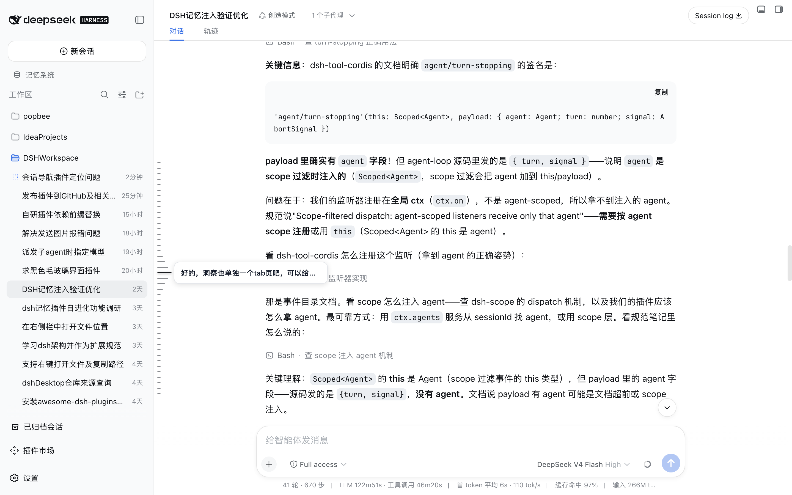
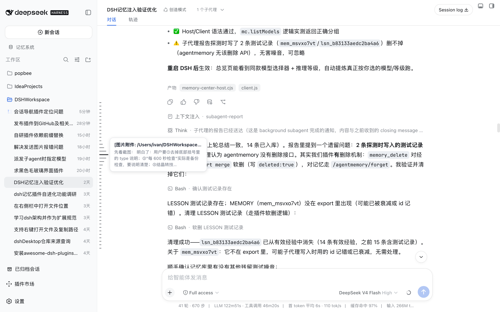
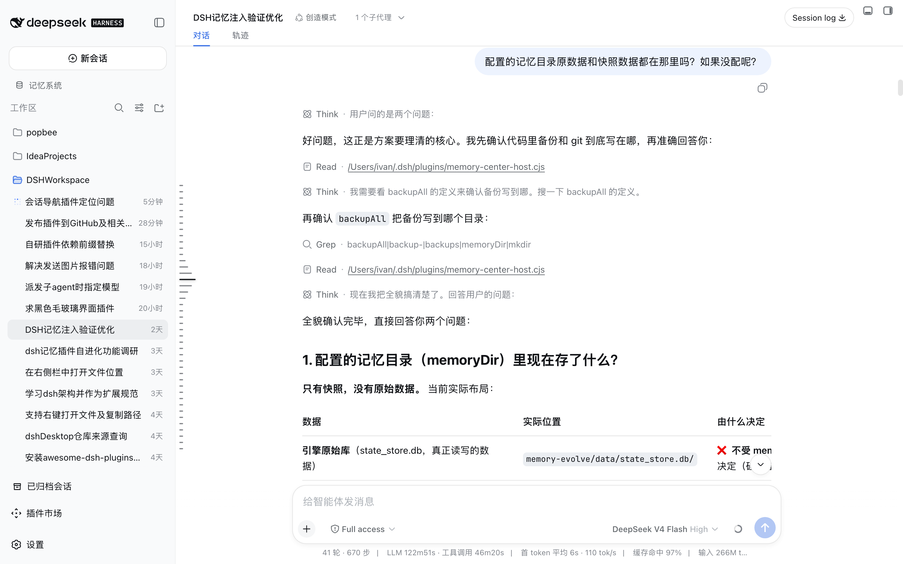

# dsh-session-nav


[简体中文](./README.md) | English

A **piano-key style in-conversation navigation bar** for the DeepSeek Harness Web GUI:
one key per real user message of the current session. Hover a key to preview that
turn's user message plus the model reply; click a key to smoothly jump to that
message. Built on the official DSH dual-face plugin mechanism (host + browser half),
no DSH source changes.

| Overview | Hover preview | Click to jump |
| --- | --- | --- |
|  |  |  |
| A 43-turn session — every user question is one key, compact cluster vertically centered in the message area. | Hover a key to see the user message (single line) plus the model reply (up to 3 lines). | Click any key to auto-page through history (same channel as the official "Load earlier" button) and land the target at the viewport top. |

Screenshots taken from a real 43-turn session (`DSH记忆注入验证优化`, light theme).

Reference implementation: [KeLearns/dsh-navigation-bar](https://github.com/KeLearns/dsh-navigation-bar)
(visual spec and interactions aligned, code independently rewritten).

## Features

- **Per-session navigation**: one key = one user message (steering messages sent
  while the agent is running are included), ordered by time; model replies never
  take a key of their own — they join the turn's preview.
- **Full history**: keys are built from the **complete session log** read on demand
  by the host half (`sessionPersistence.readFrom`), not from the browser's loaded
  window — long sessions (hundreds of turns) show every user question at once;
  merged with the live snapshot and deduplicated by message UUID (no duplicate keys).
- **Visual spec**: compact key cluster, fixed 10px pitch, 2px bar height, 6px base
  length, 26px hovered length (≈4.3×), **vertically centered** in the message area;
  light `#D2D3D3` / `#767779` / `#1A1C1F`, dark `#454545` / `#A3A3A3` / `#FFFFFF`.
- **Hover ladder**: the hovered key grows and recolors, neighbors step 20 / 14 / 10px
  (≈77% / 54% / 38%), the 4th neighbor returns to base; first/last keys clip naturally.
- **Hover tooltip**: user message single-line ellipsis + model reply up to 3 lines
  (JS width-model truncation + `-webkit-line-clamp` double insurance), vertically
  centered on the key.
- **Active highlight**: while not hovering, the key of the message currently in view
  changes color only (length unchanged), re-evaluated live on scroll.
- **Click-to-jump**: if the target message is inside the loaded window, scroll
  smoothly to it; if it is outside (virtualized history not yet loaded), the plugin
  automatically pulls older pages through the official paging API (the same channel
  as the "Load earlier" button) until the target row renders, then lands it at the
  top of the viewport.
- **Light/dark theme** via `data-ds-dark-theme` + `prefers-color-scheme` fallback.

## Install

### From GitHub (recommended)

```bash
dsh plugin --profile web add github:kiligzzz/dsh-session-nav
```

### Local development (link)

```bash
dsh plugin --profile web add link:<this-directory>
```

Note: the plugin roster is loaded when the instance starts — after installing a new
plugin, restart the `dsh web` instance, then refresh the page. Editing
`lib/client.js` only needs a page refresh (dynamically loaded client bundle).

## Structure

| File | Description |
| --- | --- |
| `index.js` | Host half: reads the full session log and exposes the same-origin route `/_dsh/session-nav/questions` |
| `lib/client.js` | Browser half (hand-written bundle, no build step; `window.__ModuleLoader__.load`) |
| `cordis.patch.yml` | Bundle patch: inserts the plugin row into the web profile roster |
| `package.json` | `dsh.bundle.patch` + `dsh.client` (platform web) declarations |

Data sources (all official APIs):
- `ctx.sessions.binding(currentId).session` → `ConversationSnapshot`
  (`useSyncExternalStore` live subscription)
- `ctx.sessionPersistence.readFrom(sessionId, 0)` → full session log (host half)
- DOM anchors: scroll container `[data-conversation-scroll]`, message rows
  `[data-chat-anchor-key]`
- Paging: `session.loadOlder()` (same channel as the official "Load earlier" button)

## Performance

Event-driven geometry tracking: scroll capture / resize / lazily attached scrollport
ResizeObserver → rAF-merged recomputes; no perpetual MutationObserver, no timers.
Anchor rows go through an `isConnected`-validated cache so virtualized list recycling
stays cheap.

## Development

Requirements: Node.js >= 18.

```bash
pnpm install        # dev dependencies (vitest, eslint, prettier)
pnpm test           # run the unit test suite (31 tests)
pnpm lint           # eslint check
pnpm format         # prettier formatting
```

Layout notes:

- Pure helpers (text extraction, truncation, key identity, cluster geometry)
  live in `lib/shared.js` so the host and browser halves share one
  implementation and the tests cover it once.
- The browser half is a hand-written bundle with no build step: edit
  `lib/client.js` and refresh the page; host changes (`index.js`) need a
  plugin reload.
- `window.__dssnNavDebug__` exposes diagnostics (`entryCount`, `fullCount`,
  `stats`) for CDP inspection.

## License

MIT
